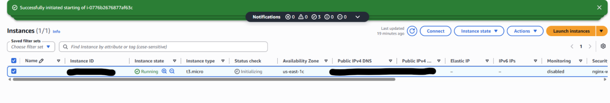
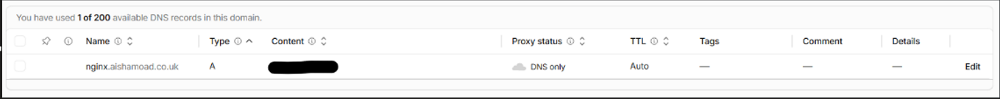
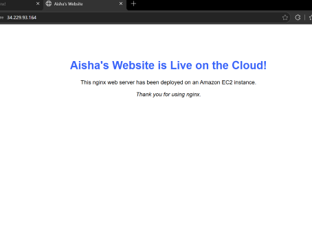

## Practical Assignment: Host an NGINX Web Server on AWS EC2 and Connect a Domain

**Objective:** Launch an EC2 instance, install NGINX, allow HTTP traffic, and point a Cloudflare DNS record to the EC2 public IPv4 address.

**Final architecture:**

Browser → nginx.aishamoad.co.uk → Cloudflare DNS A record → EC2 Public IPv4 address
→ AWS Security Group (TCP port 80) → NGINX web server → "Welcome to nginx!" page


### Step 1: Buy or Register a Domain
Purchase or register a domain using a provider such as Cloudflare or AWS Route 53.
Example: `aishamoad.co.uk`

### Step 2: Launch an EC2 Instance

In the AWS Console:
1. Open EC2
2. Select **Instances**
3. Click **Launch instances**
4. Give the instance a name (e.g. `Myweb`)
5. Select an operating system: **Amazon Linux 2023** (Ubuntu can also be used)
6. Select an appropriate instance type, such as `t3.micro`
7. Create or select an SSH key pair
8. Download and securely store the `.pem` key file
9. Configure a security group:

| Rule | Protocol | Port | Source |
|---|---|---|---|
| SSH | TCP | 22 | My IP |
| HTTP | TCP | 80 | Anywhere (0.0.0.0/0) |

10. Launch the instance

### Step 3: Connect to the EC2 Instance

From WSL, move or copy the key into a secure location and set the correct permissions:
```bash
chmod 400 ~/Downloads/your-key.pem
```

Connect using:
```bash
ssh -i ~/Downloads/your-key.pem ec2-user@YOUR-EC2-PUBLIC-IP
```

For Amazon Linux, the default username is usually `ec2-user`. For Ubuntu, it's usually `ubuntu`.



### Step 4: Install NGINX

For Amazon Linux 2023:
```bash
sudo dnf install -y nginx
```

Enable NGINX so it starts automatically after a reboot:
```bash
sudo systemctl enable nginx
```

Start NGINX:
```bash
sudo systemctl start nginx
```

Check the service:
```bash
sudo systemctl status nginx
```

Expected status: `Active: active (running)`
Press `q` to exit the status screen.

### Step 5: Test NGINX Locally

```bash
curl http://localhost
```

You should receive HTML containing: `Welcome to nginx!`

Check that NGINX is listening on port 80:
```bash
sudo ss -tulpn | grep :80
```

Expected output should include `0.0.0.0:80` — this means NGINX is listening on port 80 across all IPv4 interfaces.

### Step 6: Test Using the EC2 Public IPv4 Address

In the AWS EC2 console:
1. Select the instance
2. Copy the Public IPv4 address
3. Open a browser
4. Visit: `http://YOUR-EC2-PUBLIC-IP`

Do **not** use the private IP address. Example: `http://xx.xxx.xx.xxx`

The NGINX landing page should load.

**If the page does not load:**
- Confirm the instance is running
- Confirm the security group allows TCP port 80 from `0.0.0.0/0`
- Confirm NGINX is active
- Confirm NGINX is listening on port 80
- Test another browser if the configuration appears correct

### Step 7: Create the Cloudflare DNS Record

In Cloudflare:
1. Open the domain
2. Go to **DNS → Records**
3. Click **Add record**
4. Configure:

| Setting | Value |
|---|---|
| Type | A |
| Name | `nginx` |
| IPv4 address | EC2 Public IPv4 address |
| Proxy status | DNS only |
| TTL | Auto |

Example: Type `A`, Name `nginx`, IPv4 address `xx.xxx.xx.xxx`, Proxy status `DNS only`, TTL `Auto`

Cloudflare automatically combines the record name with the domain: `nginx.aishamoad.co.uk`



### Step 8: Test the Domain

Wait for the DNS record to propagate, then open:
`http://nginx.aishamoad.co.uk`

The NGINX default page should appear.



---

## Important Notes
- Use the EC2 **Public** IPv4 address in the Cloudflare A record, not the private IP
- A private address such as `172.31.x.x` is used inside AWS and is not directly reachable from the public internet
- An auto-assigned EC2 public IPv4 address may change after the instance is stopped and started
- If the public IP changes, update the Cloudflare A record
- An Elastic IP can provide a persistent public IPv4 address if needed
- Stop the EC2 instance when it is not needed to avoid unnecessary charges
- Do not terminate the instance unless you are finished and no longer need its configuration

---

## Key Takeaway

This assignment demonstrated how networking concepts work together in a real cloud environment:

Domain name → DNS → Public IP address → Routing → AWS security group
→ TCP port 80 → NGINX web server → HTTP response → Browser


The project connected DNS, public and private IP addressing, routing, ports, firewalls/security groups, HTTP, Linux service management, and cloud infrastructure into one practical workflow.
